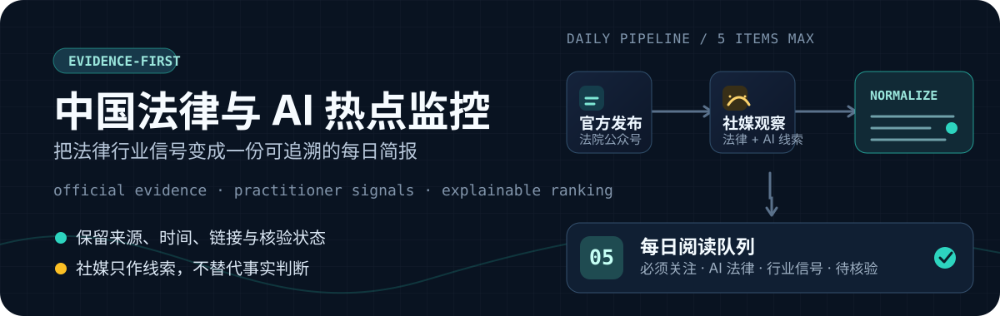

<p align="center">
  
</p>

<p align="center">
  <strong>面向法律行业与 AI 法律的证据优先日报生产工具</strong><br>
  把公开信源与从业者讨论分开处理，输出可读、可追溯、可复核的五条简报。
</p>

<p align="center">
  <a href="#快速开始">快速开始</a> · <a href="#日报结构">日报结构</a> · <a href="#工作流">工作流</a> · <a href="#边界与原则">边界与原则</a>
</p>

## 它解决什么

法律行业的 AI 变化同时出现在两类信源里：一类是法院、监管机构和官方账号的可核验发布；另一类是律师、法务、法律科技团队的实践信号。前者可靠但分散，后者敏感但不能直接当作事实。

`china-legal-ai-monitor` 将两条线分开采集，再在同一份日报中呈现：官方材料优先，社媒线索明确标注为 `待核验`，每个条目保留来源、时间、链接、主题、收集路径与入选原因。

## 一眼看懂输出

生成的日报固定控制在 **5 条**。它不是“热点堆砌”，而是一份带来源链路的阅读队列：

- **必须关注**：已核验的政策、司法、监管或重要市场事件。
- **AI 法律**：模型、产品、治理、数据合规、司法 AI 与法律科技变化。
- **行业信号**：律所、律师、企业法务和从业者的公开实践线索。
- **雷达补充 / 待核验**：可信但未进入主阅读队列的内容，以及仅有社媒证据的线索。
- **行动建议**：1–3 个可执行的后续核验或跟进动作，不构成法律意见。

可查看一份已渲染的示例：[`daily-preview.md`](./daily-preview.md)。

## 快速开始

### 1. 准备公开数据导出

将已授权的公开数据导出为 JSON 或 JSONL，放入本地收件目录。社媒导出只保留必要的公开帖子级数据；法院公众号全文仅从合规导出的成功记录导入。

```text
~/legal-monitor/
├── inbox/
│   ├── official-court.jsonl
│   └── xiaohongshu-legal-ai.jsonl
└── digests/
```

### 2. 生成一份日报

```bash
mkdir -p ~/legal-monitor/inbox ~/legal-monitor/digests

python3 scripts/build_digest.py \
  --input ~/legal-monitor/inbox \
  --state ~/legal-monitor/state.json \
  --output ~/legal-monitor/digests/$(date +%F).md \
  --limit 5 \
  --defer-days 2
```

首次验证格式时使用 `--dry-run`，它不会消耗已排队的候选项：

```bash
python3 scripts/build_digest.py \
  --input ~/legal-monitor/inbox \
  --state ~/legal-monitor/state.json \
  --output ~/legal-monitor/digests/test.md \
  --dry-run
```

## 工作流

1. **分线收集**：官方法院公众号与社媒公开线索分别入库，避免以热度替代权威。
2. **标准化与去重**：优先按规范化链接识别重复项，并保留收集路径与原始来源。
3. **透明筛选**：根据时效、法律与 AI 主题、信源、互动信号和交叉佐证排出初始队列。
4. **编辑复核**：高优先级社媒线索须回到一手来源；未核验内容保留而不伪装成结论。
5. **五条交付**：合并官方与社媒队列，输出阅读优先级、入选理由与可跟进动作。

## 项目内容

| 组件 | 作用 |
| --- | --- |
| [`scripts/build_digest.py`](./scripts/build_digest.py) | 规范化、去重、评分、排队并渲染 Markdown 日报。 |
| [`scripts/import_wxmp_harvest.py`](./scripts/import_wxmp_harvest.py) | 将合规导出的法院公众号全文转换为日报输入。 |
| [`integrations/wxmp-article-harvester/`](./integrations/wxmp-article-harvester/) | 公众号全文采集前检与受控导出流程。 |
| [`integrations/wechat-article-search/`](./integrations/wechat-article-search/) | 用于发现公开文章链接与核对账号名。 |
| [`references/`](./references/) | 信源分层、筛选规则、社媒收集边界与示例观察列表。 |

## 日报结构

每条内容都保留：标题、来源/平台、时间、规范化 URL、主题桶、收集路径、信号标签，以及“为什么值得看”。

```markdown
### 01. 标题
*来源：官方机构 · 2026-07-31*

一句话摘要。

**推荐理由**：含具体规则、可提取实务路径、一手权威来源

[阅读原文](https://example.com)
```

详细的信源层级、选题桶和可解释评分规则见 [`references/sources-and-scoring.md`](./references/sources-and-scoring.md)。

## 边界与原则

- 仅处理用户有权访问的公开数据，不绕过登录、验证码、付费墙、速率限制或平台控制。
- 不采集私信、个人档案、联系方式或不必要的评论内容；默认只保留公开帖子级信息。
- 社媒内容是发现层，不是法律、监管或产品事实；高优先级线索必须回到一手来源核验。
- 自动评分只用于阅读排序，不能替代法律判断、合规结论或个案意见。
- 原始采集结果、Cookie、令牌、状态文件与真实观察列表都应保留在本地，切勿提交到仓库。

## 进一步配置

- 在 [`references/account-watchlist.example.json`](./references/account-watchlist.example.json) 的基础上，于仓库外维护经批准的公开账号观察列表。
- 阅读 [`references/social-collection.md`](./references/social-collection.md)，按“账号监控”与“关键词发现”两条队列分开运行。
- 如需每天定时运行，使用 [`scripts/configure_daily_schedule.py`](./scripts/configure_daily_schedule.py) 配置本地时间，并先以 `--dry-run` 验证输出。

---

这个项目帮助你建立更好的法律行业信息判断流程；它不提供法律意见，也不替代人工核验。
